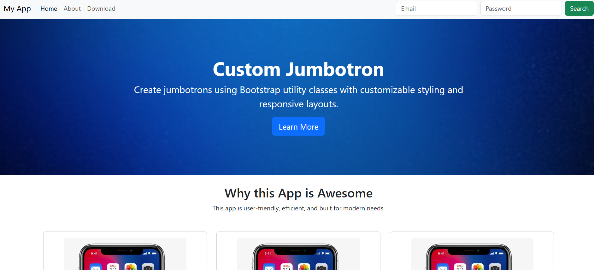

# 📱 Responsive Web App Landing Page

A **responsive landing page** built using **Bootstrap 5** that showcases a web application with a modern and user-friendly design. The landing page includes a navigation bar, a jumbotron section, a three-card layout for features, and a footer with download information.


<sub>*Screenshot of the project in action*</sub>

---

## 🚀 Features

| Feature | Description |
|---------|-------------|
| **Responsive Navbar** | A collapsible Bootstrap navigation bar that adapts to a hamburger menu on smaller screens. |
| **Jumbotron Section** | A prominent hero area with a background image and a call-to-action button. |
| **Three-Card Feature Grid** | A Bootstrap grid layout presenting three core features of the app in individual cards. |
| **Footer** | A footer with download information and an app store icon. |
| **Semantic HTML Tags** | Utilizes `header`, `main`, `section`, `article`, and `footer` tags for clean structure and improved accessibility. |

---

## 📁 Project Structure

| Path | Description |
|------|-------------|
| `index.html` | The main HTML file containing the structure of the landing page. |
| `blue.jpg` | Background image for the jumbotron section. |
| `card.jpg` | Placeholder image for the feature cards. |
| `appstore.png` | App store badge for the download section. |
| `README.md` | This readme file. |

---

## 🛠️ Built With

| Technology | Version | Description |
|------------|---------|-------------|
| [Bootstrap](https://getbootstrap.com/) | 5.3 | A popular CSS framework for developing responsive and mobile-first websites. |
| HTML5 | - | The latest version of HTML for structuring and presenting content on the web. |
| CSS3 | - | The latest version of CSS for styling web pages. |

---

## 🧑‍💻 Getting Started

### Prerequisites

To run this project locally, you need a web browser such as Google Chrome, Mozilla Firefox, or Safari.

### Installation

1. Clone the repository:
   ```bash
   git clone https://github.com/your-username/your-repo-name.git

2. Open index.html in your browser